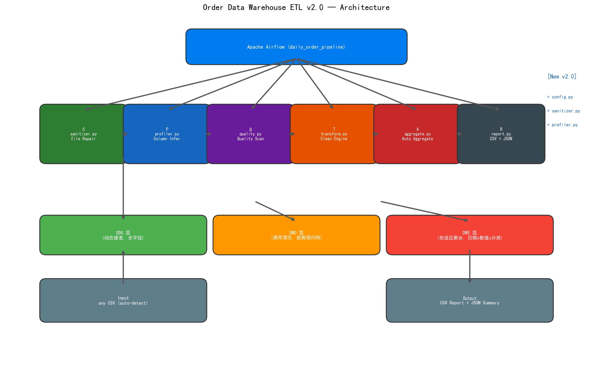

<a id="top"></a>

<!-- PROJECT SHIELDS -->
<div align="center">

[![Python][python-shield]][python-url]
[![Tests][tests-shield]][tests-url]
[![PostgreSQL][pg-shield]][pg-url]
[![Airflow][airflow-shield]][airflow-url]
[![License][license-shield]][license-url]

</div>

<br />
<div align="center">
  <h1>🔧 Order Data Warehouse ETL</h1>
  <p>
    <strong>Drop any CSV. Get a full warehouse pipeline.</strong><br />
    Zero hardcoding. Zero assumptions about your industry.
  </p>
</div>

<br />

---

## 📸 Architecture

<div align="center">
  
</div>

```
           whatever.csv
                │
   S(File Repair) → P(Column Infer) → Q(Quality) → T(Clean) → A(Aggregate) → R(Report)
```

> **Six-layer pipeline.** Each layer does one job, has no knowledge of the others, and can be tested in isolation.

---

## 💡 Why this project

- **Most ETL is single-dataset.** Hardcoded column names, hardcoded business rules. Change the source file and everything breaks. We've been there.
- **This one is different.** It reads the *structure* of your data — dates, numbers, categories, IDs — and builds the pipeline around that. It doesn't need to know your industry.
- **86 tests. Zero regressions.** UCI Retail and E-Commerce 2026 datasets both pass clean. Old code still works. New code just works with anything.

| What you get | How |
|-------------|------|
| 🧠 **Auto column profiling** | dtype + stats + naming patterns — classifies every column as date / metric / dimension / ID / boolean |
| 🧹 **Configurable cleaning** | Rules are YAML, not code. Cancel detection, required fields, value validations — all swappable |
| 📊 **Adaptive aggregation** | DATE columns → time dimension · NUMERIC columns → SUM+AVG · TEXT columns → COUNT DISTINCT |
| 🔒 **Backward compatible** | UCI dataset still runs on the original hardcoded path if you want it |

---

## ⚡ Quick Start

```bash
# 1. Clone & install
git clone https://github.com/886ss/order-etl-project.git
cd order-etl-project
pip install -r requirements.txt

# 2. Set up PostgreSQL
createdb order_warehouse
psql -d order_warehouse -f sql/create_tables.sql

# 3. Drop ANY CSV and run
python -c "
from etl.extract import auto_extract
print(auto_extract('your_file.csv'))
"
# → {status: 'success', rows: 30000, schema: {date_columns: [...], ...}}
```

```bash
# Or run step-by-step (Airflow-free)
python etl/extract.py data/online_retail.csv   # CSV → ODS
python etl/quality.py                          # Quality check
python etl/transform.py                        # Clean → DWD
python etl/aggregate.py                        # Aggregate → DWS
python etl/report.py                           # CSV + JSON report
```

> 💡 **No Airflow?** No problem. Every step runs standalone with `python etl/<module>.py`.
> 💡 **Want scheduling?** `export AIRFLOW_HOME=$(pwd) && airflow standalone`

---

<details>
<summary>📑 Full Table of Contents</summary>

- [Architecture](#-architecture)
- [Why this project](#-why-this-project)
- [Quick Start](#-quick-start)
- [How It Works](#-how-it-works)
  - [v2.0 Auto Mode](#auto-mode-any-csv)
  - [v1.0 Classic Mode](#classic-mode-uci-dataset)
- [Project Structure](#-project-structure)
- [Data Warehouse Layers](#-data-warehouse-layers)
- [Airflow DAG](#-airflow-dag)
- [Testing](#-testing)
- [Extension Points](#-extension-points)
- [License](#-license)

</details>

---

## 🧠 How It Works

### Auto Mode (any CSV)

```python
from etl.extract import auto_extract
from etl.transform import clean_data_auto
from etl.aggregate import auto_aggregate
from etl.report import auto_report

# ── Step 1: Read + Profile ──
result = auto_extract("whatever.csv")
# Reads the file (auto-detects encoding, separator, BOM)
# Profiles columns → {date: 3, numeric: 12, categorical: 8, id: 2, bool: 1}

# ── Step 2: Clean ──
df_clean, rejected = clean_data_auto(df, schema)
# Applies cancel/required/validation rules from schema
# int64 columns get lazy `.astype(str)` — never crash on `.str` calls

# ── Step 3: Aggregate ──
agg = auto_aggregate(df_clean, schema)
# GROUP BY date columns · SUM+AVG on numeric columns · COUNT DISTINCT on categories
# ID columns are automatically excluded from aggregations

# ── Step 4: Report ──
auto_report(agg["result"], agg["summary"])
# → reports/data_report_YYYYMMDD.csv + data_summary_YYYYMMDD.json
```

**Core insight:** The engine doesn't know or care if your columns are called `InvoiceNo` or `Order_ID` or `patient_visit_id`. It sees `object → categorical`, `float64 → numeric`, `datetime → date dimension`.

### Classic Mode (UCI dataset)

```bash
# Traditional pipeline — hardcoded for UCI Online Retail
python etl/extract.py data/online_retail.csv
# Still works exactly as before. 36 original tests still pass.
```

### YAML Override (optional, for fine-tuning)

```yaml
# data/schema_2026.yaml — swap this one file to support a completely different dataset
source_column_mapping:
  Order_ID: invoice_no
  Product_ID: stock_code
  Product_Category: description
  Order_Date: invoice_date
  Unit_Price: unit_price
  Customer_ID: customer_id
  Country: country

cleaning:
  cancel_rules: []          # This dataset uses 'Returned' column, not 'C' prefix
  validations:
    - {column: quantity, operator: gt, value: 0}
    - {column: unit_price, operator: gt, value: 0}
  computed_columns:
    - {name: order_amount, expression: "quantity * unit_price"}
```

> Two datasets. Same codebase. [etl/schema.yaml](etl/schema.yaml) for UCI, [data/schema_2026.yaml](data/schema_2026.yaml) for the 2026 dataset. 1 file to change.

---

## 🏗️ Project Structure

```
order-etl-project/
├── etl/                         # Core engine
│   ├── config.py                # RuntimeSchema + YAML loader + JSON cache
│   ├── sanitizer.py             # S-layer: encoding, separator, BOM, headers (8 checks)
│   ├── profiler.py              # P-layer: column role inference (11 checks)
│   ├── extract.py               # Step 1: CSV → ODS (classic + auto)
│   ├── quality.py               # Step 2: nulls / duplicates / outliers / freshness
│   ├── transform.py             # Step 3: clean_data() + clean_data_auto()
│   ├── aggregate.py             # Step 4: fixed metrics + auto_aggregate()
│   ├── report.py                # Step 5: CSV/JSON report
│   ├── db.py                    # Connection pool + load strategies
│   ├── notify.py                # WeCom / Feishu / SMTP alerts
│   └── schema.yaml              # Default schema (UCI)
├── dags/
│   └── daily_order_pipeline.py  # Airflow DAG (retry ×3, alert callback)
├── sql/
│   ├── create_tables.sql        # Table DDL + indexes + lineage comments
│   └── verify_tables.sql        # Schema validation
├── tests/
│   ├── test_config.py           # 9 tests
│   ├── test_profiler.py         # 29 tests
│   ├── test_e2e_auto.py         # 12 end-to-end + bug regression tests
│   ├── test_*.py                # ... 36 original tests
├── docs/                        # Architecture diagrams
├── data/                        # Dataset directory (gitignored)
├── reports/                     # Output directory
└── requirements.txt
```

| Layer | Module | Responsibilities |
|-------|--------|-----------------|
| **S**anitizer | `sanitizer.py` | Encoding detection, separator sniffing, BOM stripping, header repair, trailing-row removal |
| **P**rofiler | `profiler.py` | dtype inference, column role classification (date / numeric / categorical / id / bool / drop) |
| **Q**uality | `quality.py` | Null checks, duplicate detection, outlier flagging, freshness check, cross-column validation |
| **T**ransform | `transform.py` | `clean_data_auto()` — schema-driven cancel / required / validation / computed rules |
| **A**ggregate | `aggregate.py` | `auto_aggregate()` — date dims × numeric metrics × category dimensions, ID-excluded |
| **R**eport | `report.py` | `auto_report()` — CSV + JSON dual output |

---

## 📊 Data Warehouse Layers

| Layer | Table | Strategy |
|-------|-------|----------|
| **ODS** | `ods_orders` | Dynamic schema — all input columns preserved |
| **DWD** | `dwd_orders` | Cleaned + computed columns, rejected rows → `ods_orders_rejected` |
| **DWS** | `dws_sales_daily` | Adaptive aggregation — date × numeric × categorical, UPSERT on conflict |
| **Log** | `etl_task_logs` | Every step tracked with duration + status |

```text
CSV ──[auto_extract]──► ods_orders (ODS) ──[clean_data_auto]──► dwd_orders (DWD)
                                                                     │
                                              ods_orders_rejected ◄──┘ (governance recycle bin)
                                                                     │
                                              dws_sales_daily ◄──[auto_aggregate]──┘ (DWS)
```

---

## 🔄 Airflow DAG

```
extract_orders ──► check_quality ──► build_dwd ──► build_dws ──► generate_report ──► finish
```

| Setting | Value |
|---------|-------|
| Schedule | Daily 2:00 UTC (`0 2 * * *`) |
| Retries | 3×, 5 min intervals |
| Alert | `on_failure_callback` → WeCom / Feishu / Email |
| Modes | Full (`TRUNCATE + INSERT`) / Incremental (`APPEND` by execution date) |

---

## 🧪 Testing

```bash
pytest tests/ -v
# 86 passed — 36 original + 50 new (config, profiler, end-to-end, bug regression)
```

| Suite | Tests | Covers |
|-------|-------|--------|
| `test_db.py` | 4 | Atomic transactions, append semantics |
| `test_extract.py` | 4 | CSV reading, column validation |
| `test_quality.py` | 7 | Null/duplicate/abnormal detection, threshold warnings |
| `test_transform.py` | 9 | Cancel filtering, null removal, validation, computed columns |
| `test_aggregate.py` | 3 | Aggregation formulas, distinct counts |
| `test_report.py` | 4 | Summary generation, file output |
| `test_notify.py` | 5 | Multi-channel broadcast, failure isolation |
| `test_config.py` | 9 | YAML loading, schema merging, cache round-trip |
| `test_profiler.py` | 29 | Date/numeric/id/bool/drop detection, encoding, separator sniffing |
| `test_e2e_auto.py` | 12 | Full pipeline S→P→Q→T→A→R, all 4 critical bug fixes verified |

---

## 🧩 Extension Points

### Add a new data source
Copy `etl/schema.yaml`, adjust `source_column_mapping` and `cleaning` rules. That's it.

### Custom aggregation
Override `auto_aggregate()` by passing a `schema_yaml` with explicit metric/group columns.

### New output format
Add a writer function in `report.py` following the `_write_*` pattern. `auto_report()` is a thin orchestrator.

### Production deployment
Set `INCREMENTAL_MODE = True` in the DAG file. DWS layer uses `INSERT ON CONFLICT DO UPDATE` — safe to re-run.

---

## 📄 License

MIT · [886ss/order-etl-project](https://github.com/886ss/order-etl-project)

<p align="right">(<a href="#top">back to top</a>)</p>

<!-- SHIELD REFERENCE LINKS -->
[python-shield]: https://img.shields.io/badge/Python-3.9+-blue
[python-url]: https://python.org
[tests-shield]: https://img.shields.io/badge/tests-86/86-brightgreen
[tests-url]: https://github.com/886ss/order-etl-project/actions
[pg-shield]: https://img.shields.io/badge/PostgreSQL-15+-336791
[pg-url]: https://www.postgresql.org
[airflow-shield]: https://img.shields.io/badge/Airflow-2.5+-017CEE
[airflow-url]: https://airflow.apache.org
[license-shield]: https://img.shields.io/badge/License-MIT-green
[license-url]: https://github.com/886ss/order-etl-project/blob/master/LICENSE
