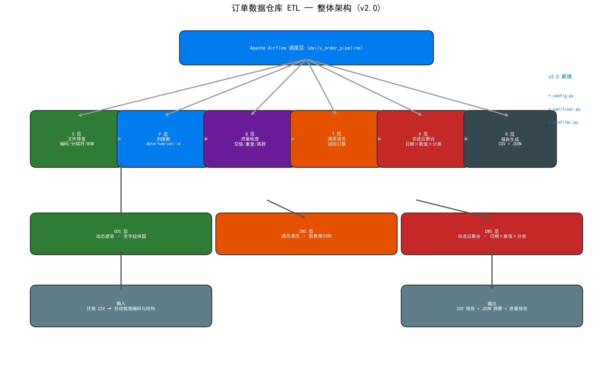
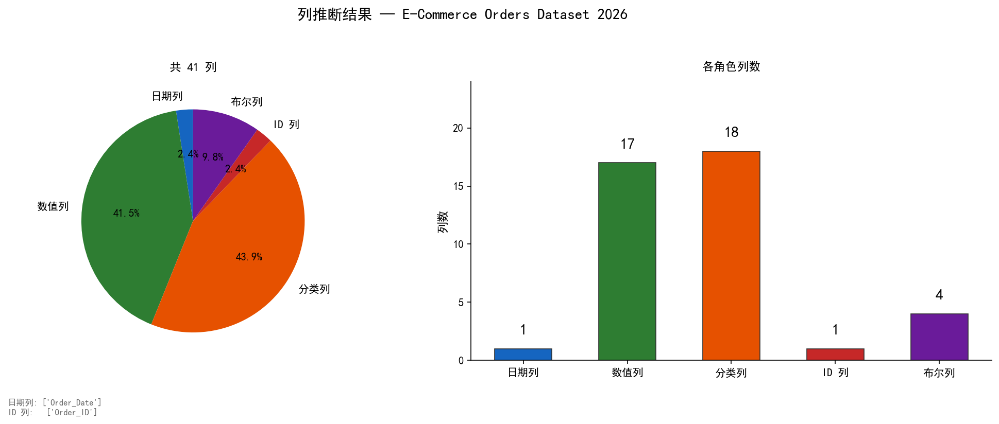
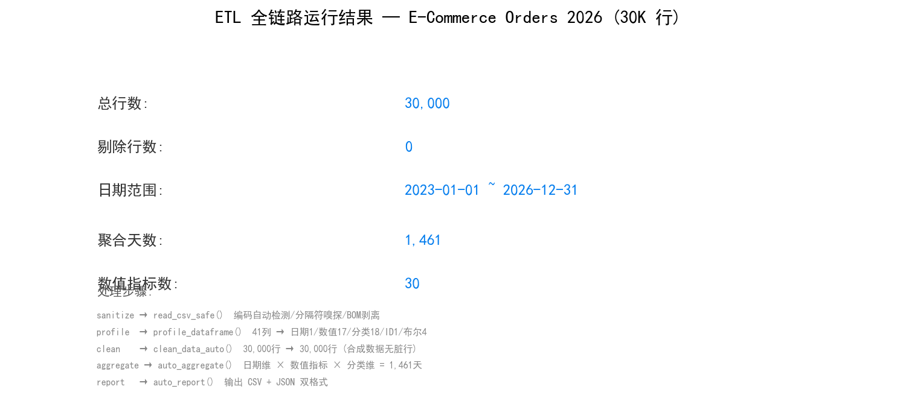
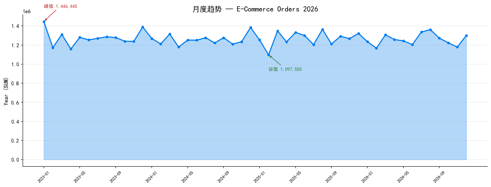

<a id="top"></a>

<div align="right">

[🇬🇧 English](README.md)

</div>

<!-- 项目徽章 -->
<div align="center">

[![Python][python-shield]][python-url]
[![Tests][tests-shield]][tests-url]
[![PostgreSQL][pg-shield]][pg-url]
[![Airflow][airflow-shield]][airflow-url]
[![License][license-shield]][license-url]

</div>

<br />
<div align="center">
  <h1>🔧 Order Data Warehouse ETL</h1>
  <p>
    <strong>任何 CSV 丢进来，自动跑完整数仓管道。</strong><br />
    零硬编码。零行业假设。零配置门槛。
  </p>
</div>

<br />

---

## 📸 架构一览

<div align="center">
  
</div>

```
         任意.csv
            │
  S(文件修复) → P(列推断) → Q(质量扫描) → T(通用清洗) → A(自适应聚合) → R(多格式报告)
```

> **六层管道，层层解耦。** 每一层只做一件事，不知道其他层的存在，可独立测试。新增一层、替换一层都不影响现有代码。

---

## 💡 为什么你需要这个项目

- **大多数 ETL 都是"单数据集专用管道"。** 列名写死、业务规则写死、聚合指标写死。换个数据源就全部崩溃。这种事我们干过太多次了。
- **这个项目不一样。** 它不看你的数据"在说什么"，只看你的数据"长什么样"——日期列就是日期列，数值列就是数值列，分类列就是分类列。你的行业是电商还是医疗，它不在乎。
- **86 个测试，零回归。** UCI 零售数据集和 2026 电商数据集两端全绿。老代码原封不动继续跑，新代码照单全收什么都能跑。

| 你能得到什么 | 怎么做到的 |
|-------------|-----------|
| 🧠 **智能列推断** | dtype + 统计特征 + 列名模式三重判定，自动归类 date / numeric / categorical / id / boolean |
| 🧹 **可配置清洗规则** | 取消检测、必填过滤、值域校验全在 YAML 里，一行 Python 都不用改 |
| 📊 **自适应聚合** | DATE 列→时间维度 · NUMERIC 列→SUM+AVG · TEXT 列→COUNT DISTINCT · ID 列自动排除 |
| 🔒 **向后兼容** | UCI 数据集仍可通过原有硬编码路径运行，36 项旧测试一个没动 |

---

## ⚡ 快速开始

```bash
# 1. 克隆 + 安装
git clone https://github.com/886ss/order-etl-project.git
cd order-etl-project
pip install -r requirements.txt

# 2. 准备 PostgreSQL
createdb order_warehouse
psql -d order_warehouse -f sql/create_tables.sql

# 3. 随便丢一个 CSV，跑起来
python -c "
from etl.extract import auto_extract
print(auto_extract('你的文件.csv'))
"
# → {status: 'success', rows: 30000, schema: {date_columns: [...], ...}}
```

```bash
# 也可以分步执行（无需 Airflow）
python etl/extract.py data/online_retail.csv   # CSV → ODS
python etl/quality.py                          # 质量检查
python etl/transform.py                        # 清洗 → DWD
python etl/aggregate.py                        # 聚合 → DWS
python etl/report.py                           # CSV + JSON 报告
```

> 💡 **没有 Airflow？** 没关系。每个步骤都可以单独运行 `python etl/<模块>.py`。
> 💡 **需要调度？** `export AIRFLOW_HOME=$(pwd) && airflow standalone`

---

<details>
<summary>📑 完整目录</summary>

- [架构一览](#-架构一览)
- [为什么你需要这个项目](#-为什么你需要这个项目)
- [快速开始](#-快速开始)
- [工作原理](#-工作原理)
  - [自动模式（任意 CSV）](#自动模式任意-csv)
  - [经典模式（UCI 数据集）](#经典模式uci-数据集)
- [项目结构](#-项目结构)
- [数仓分层](#-数仓分层)
- [Airflow 调度](#-airflow-调度)
- [测试覆盖](#-测试覆盖)
- [扩展点](#-扩展点)
- [许可证](#-许可证)

</details>

---

## 🧠 工作原理

### 自动模式（任意 CSV）

```python
from etl.extract import auto_extract
from etl.transform import clean_data_auto
from etl.aggregate import auto_aggregate
from etl.report import auto_report

# ── Step 1: 读取 + 画像 ──
result = auto_extract("随便什么文件.csv")
# 自动检测编码、分隔符、BOM → 读入 DataFrame
# 自动画像 → {date: 3, numeric: 12, categorical: 8, id: 2, bool: 1}

# ── Step 2: 清洗 ──
df_clean, rejected = clean_data_auto(df, schema)
# 按 schema 中的 cancel/required/validation/computed 规则清洗
# int64 列惰性 astype(str)，再也不会在 .str 操作上崩溃

# ── Step 3: 聚合 ──
agg = auto_aggregate(df_clean, schema)
# 日期列 GROUP BY · 数值列 SUM+AVG · 分类列 COUNT DISTINCT
# ID 列自动排除，不会出现"用户 ID 之和"这种无意义数字

# ── Step 4: 出报告 ──
auto_report(agg["result"], agg["summary"])
# → reports/data_report_YYYYMMDD.csv + data_summary_YYYYMMDD.json
```

**核心洞见：** 引擎不关心你的列叫 `InvoiceNo` 还是 `Order_ID` 还是 `patient_visit_id`。它只看到 `object → categorical`、`float64 → numeric`、`datetime → date dimension`。语义留给人类，结构交给机器。

### 经典模式（UCI 数据集）

```bash
# 传统五步管道 — UCI Online Retail 专用
python etl/extract.py data/online_retail.csv
# 和以前完全一样。36 项旧测试全绿。
```

### YAML 覆盖（可选，精细调优）

```yaml
# data/schema_2026.yaml — 换一个 YAML 就适配一个全新数据集
source_column_mapping:
  Order_ID: invoice_no
  Product_ID: stock_code
  Product_Category: description
  Order_Date: invoice_date
  Unit_Price: unit_price
  Customer_ID: customer_id
  Country: country

cleaning:
  cancel_rules: []          # 这个数据集用 'Returned' 列，不用 'C' 前缀
  validations:
    - {column: quantity, operator: gt, value: 0}
    - {column: unit_price, operator: gt, value: 0}
  computed_columns:
    - {name: order_amount, expression: "quantity * unit_price"}
```

> 两个数据集。同一套代码。UCI 用 [etl/schema.yaml](etl/schema.yaml)，2026 数据集用 [data/schema_2026.yaml](data/schema_2026.yaml)。**换数据集 = 换 1 个 YAML。**

---

## 🏗️ 项目结构

```
order-etl-project/
├── etl/                         # 核心引擎
│   ├── config.py                # RuntimeSchema 数据类 + YAML 加载 + JSON 缓存
│   ├── sanitizer.py             # S 层：编码、分隔符、BOM、表头修复（8 项检测）
│   ├── profiler.py              # P 层：列角色推断（11 项检测）
│   ├── extract.py               # Step 1: CSV → ODS（经典 + 自动双模式）
│   ├── quality.py               # Step 2: 空值 / 重复 / 离群值 / 时效性检查
│   ├── transform.py             # Step 3: clean_data() + clean_data_auto()
│   ├── aggregate.py             # Step 4: 固定指标 + auto_aggregate()
│   ├── report.py                # Step 5: CSV / JSON 双格式报告
│   ├── db.py                    # 连接池 + 加载策略（含 dynamic_load）
│   ├── notify.py                # 企业微信 / 飞书 / SMTP 多通道告警
│   └── schema.yaml              # 默认 schema 配置（UCI）
├── dags/
│   └── daily_order_pipeline.py  # Airflow DAG（重试 ×3 + 失败回调 + tz-aware）
├── sql/
│   ├── create_tables.sql        # 建表 DDL + 索引 + 血缘 COMMENTS
│   └── verify_tables.sql        # 表结构验证
├── tests/
│   ├── test_config.py           # 9 项
│   ├── test_profiler.py         # 29 项
│   ├── test_e2e_auto.py         # 12 项端到端 + Bug 回归
│   ├── test_*.py                # ... 原 36 项旧测试
├── docs/                        # 架构图
├── data/                        # 数据集目录（gitignored）
├── reports/                     # 报告输出目录
└── requirements.txt
```

| 层 | 模块 | 职责 |
|----|------|------|
| **S**anitizer | `sanitizer.py` | 编码检测、分隔符嗅探、BOM 剥离、表头修复、尾部汇总行移除 |
| **P**rofiler | `profiler.py` | dtype 推断、列角色归类（date / numeric / categorical / id / bool / drop） |
| **Q**uality | `quality.py` | 空值检查、重复检测、离群值标记、时效性、跨列交叉校验 |
| **T**ransform | `transform.py` | `clean_data_auto()` — schema 驱动的取消/必填/校验/计算规则引擎 |
| **A**ggregate | `aggregate.py` | `auto_aggregate()` — 日期维 × 数值指标 × 分类维度，ID 列自动排除 |
| **R**eport | `report.py` | `auto_report()` — CSV + JSON 双格式输出 |

---

## 📊 数仓分层

| 层级 | 表名 | 写入策略 |
|------|------|---------|
| **ODS** | `ods_orders` | 动态建表 — 保留输入文件所有列 |
| **DWD** | `dwd_orders` | 清洗 + 计算列，脏数据归档到 `ods_orders_rejected` |
| **DWS** | `dws_sales_daily` | 自适应聚合 — 日期 × 数值 × 分类，UPSERT on conflict |
| **日志** | `etl_task_logs` | 每步执行耗时 + 状态全记录 |

```text
CSV ──[auto_extract]──► ods_orders (ODS) ──[clean_data_auto]──► dwd_orders (DWD)
                                                                     │
                                              ods_orders_rejected ◄──┘ (治理回收站)
                                                                     │
                                              dws_sales_daily ◄──[auto_aggregate]──┘ (DWS)
```

---

## 🔄 Airflow 调度

```
extract_orders ──► check_quality ──► build_dwd ──► build_dws ──► generate_report ──► finish
```

| 配置项 | 值 |
|--------|-----|
| 调度频率 | 每日凌晨 2:00 UTC (`0 2 * * *`) |
| 失败重试 | 3 次，间隔 5 分钟 |
| 失败告警 | `on_failure_callback` → 企业微信 / 飞书 / 邮件 |
| 运行模式 | 全量（`TRUNCATE + INSERT`）/ 增量（按 `execution_date` 追加） |

---

## 🧪 测试覆盖

```bash
pytest tests/ -v
# 86 passed — 36 项原始测试 + 50 项新增（config、profiler、端到端、Bug 回归）
```

| 测试套件 | 用例数 | 覆盖范围 |
|----------|--------|---------|
| `test_db.py` | 4 | 原子事务、追加写入语义 |
| `test_extract.py` | 4 | CSV 读取、列校验 |
| `test_quality.py` | 7 | 空值/重复/异常值检测、阈值预警 |
| `test_transform.py` | 9 | 取消过滤、空值剔除、值域校验、计算列 |
| `test_aggregate.py` | 3 | 聚合公式、去重计数 |
| `test_report.py` | 4 | 摘要生成、文件输出 |
| `test_notify.py` | 5 | 多通道广播、单通道故障隔离 |
| `test_config.py` | 9 | YAML 加载、Schema 合并、缓存读写 |
| `test_profiler.py` | 29 | 日期/数值/ID/布尔/丢弃列检测、编码、分隔符嗅探 |
| `test_e2e_auto.py` | 12 | 全链路 S→P→Q→T→A→R，4 项关键 Bug 修复回归 |

---

## 🧩 扩展点

### 接入新数据源
复制 `etl/schema.yaml`，修改 `source_column_mapping` 和 `cleaning` 规则。完事。

### 自定义聚合
在 `auto_aggregate()` 调用时传入 `schema_yaml`，指定精确的 `metric_columns` / `group_columns`。

### 新增输出格式
在 `report.py` 中按 `_write_*` 模式新增函数。`auto_report()` 是薄薄的编排层。

### 生产部署
将 DAG 文件中 `INCREMENTAL_MODE` 设 `True`。DWS 层使用 `INSERT ON CONFLICT DO UPDATE`，重跑安全幂等。

---

---

## 📸 实际运行效果（2026 数据集 · 30K 行 × 41 列）

<div align="center">
  
  <p><em>列推断：41 列 → 日期1 / 数值17 / 分类18 / ID1 / 布尔4</em></p>
</div>

<div align="center">
  
  <p><em>全链路：S→P→Q→T→A→R 各步骤输出</em></p>
</div>

<div align="center">
  
  <p><em>月度聚合趋势（自动选择第一个 SUM 列作为分析指标）</em></p>
</div>

---

## 📄 许可证

MIT · [886ss/order-etl-project](https://github.com/886ss/order-etl-project)

<p align="right">(<a href="#top">回到顶部</a>)</p>

<!-- SHIELD 引用链接 -->
[python-shield]: https://img.shields.io/badge/Python-3.9+-blue
[python-url]: https://python.org
[tests-shield]: https://img.shields.io/badge/tests-86/86-brightgreen
[tests-url]: https://github.com/886ss/order-etl-project/actions
[pg-shield]: https://img.shields.io/badge/PostgreSQL-15+-336791
[pg-url]: https://www.postgresql.org
[airflow-shield]: https://img.shields.io/badge/Airflow-2.5+-017CEE
[airflow-url]: https://airflow.apache.org
[license-shield]: https://img.shields.io/badge/License-MIT-green
[license-url]: https://github.com/886ss/order-etl-project/blob/master/LICENSE
